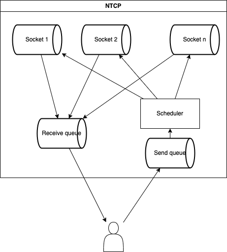

# NTCP

TCP but with a bunch of sockets and a smart scheduler.

## Overview



- NTCP represents only one stream
- NTCP guarantees that the data is delivered in order, without duplication or loss
- NTCP expects unexpected disconnections of some socket connections

## Scheduler

- say:
  - RTT of a TCP connection inversely represents the quality of the connection
  - there are $n$ connections
  - $r_i$: the RTT of the $i$-th connection
  - $r \in \mathbb{R}^n$: the RTT vector
  - $w_i$: the weight of the $i$-th connection
  - $w \in \mathbb{R}^n$: the weight vector
  - $l : \mathbb{R}^n \times \mathbb{R}^n \to \mathbb{R}$: the loss function
  - $l(r, w) = \hat{r} \cdot w$
    - $\hat{r}$: relative RTT vector
  - $w' \in \mathbb{R}^n$: the next weight vector
  - $\alpha \in \mathbb{R}$: the learning rate
- goal: minimize $l$
- the default weight vector $w$:
  ```math
  w = \left( \frac{1}{n}, \dots, \frac{1}{n} \right)
  ```
- the next weight vector $w' \in \mathbb{R}^n$:
  ```math
  w' = \frac{w - \alpha \nabla l(r, w)}{\| w - \alpha \nabla l(r, w) \|}
  ```
  - $r$: a constant vector
